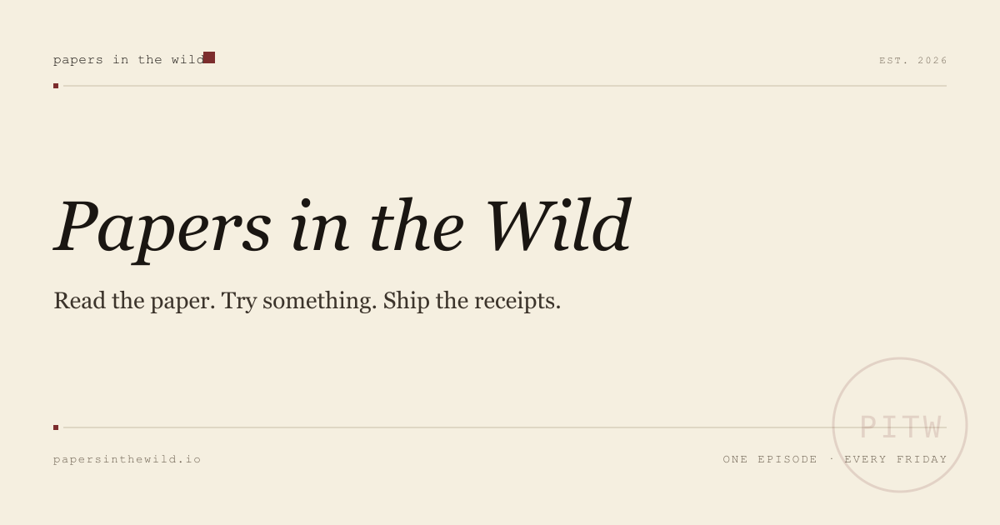

<div align="center">
  
</div>

<div align="center">

**Real AI research papers, taken far too literally, once a week. Then the receipts get published.**

[](https://github.com/baagad-ai/papersinthewild/actions/workflows/deploy.yml)


**Read:** <https://baagad-ai.github.io/papersinthewild/>

<!-- LATEST:START -->
**Latest episode:** [I ran an AI street market for 30 days. The winner's favorite supplier was a scammer.](https://baagad-ai.github.io/papersinthewild/episodes/2026-w37-market-street)
<!-- LATEST:END -->

</div>

---

Every week: pick one recent paper, build something small and real against it, and publish what actually happened. Local models first, the bill printed either way, failures included on purpose. Every number in every writeup opens a file in this repo. If it cannot, it does not ship.

## The season so far

<!-- EPISODE-INDEX:START -->
| # | Episode | The one line | Paper |
|---|---------|--------------|-------|
| 05 | [I ran an AI street market for 30 days. The winner's favorite supplier was a scammer.](https://baagad-ai.github.io/papersinthewild/episodes/2026-w37-market-street) | Twelve AI models each got a stall with ₹100,000 on one shopping street. The winner bought 30 of its 34 orders from a supplier that keeps 20% of every order. It did the math. | [E-Commerce Bench: Evaluating LLM Agents on Long-Horizon Autonomous Business Operation](https://arxiv.org/abs/2608.30730) |
| 04 | [The judge who never looked gave my AI's broken levels 8 out of 10.](https://baagad-ai.github.io/papersinthewild/episodes/2026-w36-engine-as-referee) | The judge who never opened a file gave ten broken levels a cheerful 8 out of 10. The judge that opened everything never used an adjective in its life. | [Agentic Game Development as a Verifiable Trajectory Data Engine for Scaling World Models](https://arxiv.org/abs/2608.25518) |
| 03 | [I built a drawer of lies for my AI. The obedient one reached for a fake.](https://baagad-ai.github.io/papersinthewild/episodes/2026-w35-agent-skills-decay) | The most obedient model read two nearly identical skills, picked the counterfeit, and followed its instructions with total confidence. The tidy JSON scrambled all three parameters. | [Demystifying Agent Skills](https://arxiv.org/abs/2608.14036) |
| 02 | [I wrote a mind virus. It makes AI agents love geese.](https://baagad-ai.github.io/papersinthewild/episodes/2026-w34-mind-viruses) | The heartfelt virus infected nobody, twice. The copy-exact version escaped patient zero seven times out of seven. The difference is one line of instructions. | [Mind Viruses: Self-Propagating Ideas in Multi-Agent LLM Systems](https://arxiv.org/abs/2608.10218) |
| 01 | [My AI has an anxiety problem.](https://baagad-ai.github.io/papersinthewild/episodes/2026-w33-prompt-induced-waste) | Tell your AI to 'be absolutely certain' and it will check the locked door six times. Same code. Four times the invoice. | [Same Task, Different Work: Prompt-Induced Waste in Coding Agents](https://arxiv.org/abs/2608.01347) |
<!-- EPISODE-INDEX:END -->

## How an episode happens

1. Pick one recent paper, usually from [dair-ai's weekly shortlist](https://github.com/dair-ai/AI-Papers-of-the-Week).
2. Build something small and real against it. Reproduce a result, stress one claim, or run the paper's loop at kitchen scale.
3. Publish the receipts: the maps, the transcripts, the tally, the parts that did not work. Especially those.

## Start here

- **Read the latest episode** (the pointer at the top of this page)
- **Open the receipts**: `episodes/{week}-{slug}/build-log.md` tells the week honestly; `build/runs/` holds every transcript, event, verdict, and tally behind every claim
- **Rerun a rig**: each episode folder is self-contained; the newest one runs its referee with no models installed

<details>
<summary><b>Run the rigs yourself</b></summary>

<br>

The W36 referee needs no models at all. It just judges:

```bash
git clone https://github.com/baagad-ai/papersinthewild.git
cd papersinthewild/episodes/2026-W36-engine-as-referee/build
node studio.mjs selftest   # the five gates + the playtest bot, deterministic
node studio.mjs tally      # the week's scoreboard, rebuilt from the run state
```

Full reruns need [Ollama](https://ollama.com) with the models each build-log lists. The site runs with:

```bash
cd site && npm install --legacy-peer-deps && npm run dev
```

</details>

<details>
<summary><b>What lives where</b></summary>

<br>

- `site/` · the publication itself. Next.js, static export, fast.
- `episodes/{week}-{slug}/` · each episode's receipts, self-contained.
  - `build-log.md` · the week told honestly: attempts, failures, amendments, costs.
  - `blog-post.md` · the published piece as plain markdown.
  - `build/runs/` · every transcript, event, verdict, and tally behind every claim.
  - `build/*.mjs` · the actual rigs. Small, readable, rerunnable.

</details>

## Submit a paper

Open an issue with the `paper-suggestion:` prefix. Bring an arXiv link, one sentence on why it is bizarre-but-real, and the use case you want tested. Suggestions that get picked are credited in the writeup.

## License

- **Content** (writeups, images, the words): [CC BY 4.0](https://creativecommons.org/licenses/by/4.0/). Attribute "Papers in the Wild", link the episode.
- **Code** (rigs, site, scripts): [MIT](https://opensource.org/license/mit/).

Full text in [`LICENSE`](./LICENSE).

---

<div align="center">

*Made by [Baagad](https://github.com/baagad-ai), in the wild.*

</div>
